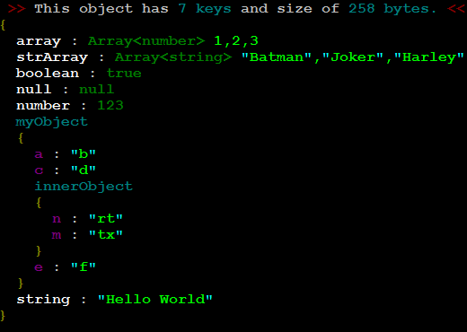

# Object Beautifier
### better `analyze` object in your `terminal`

## `Npm` 

```javascript
$ npm i object-beautifier 
```

## `Usage`

```javascript
const beautifier = require('object-beautifier');
const identity = {name : "batman" , age : 34};
console.log(beautifier(identity));
```


## `Demo`

<p align="center">
  
</p>

<br>

## `License`
 MIT
